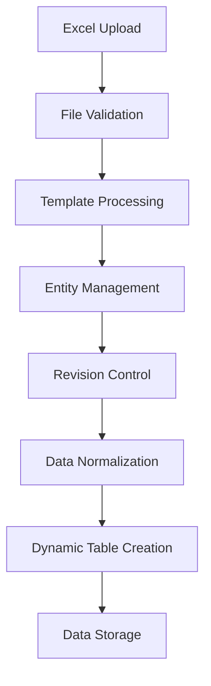

# EBOM.Shared - Engineering Bill of Materials Class Library

**Solution Name:** EBOM.Solution  
**Project Type:** Class Library (.NET)  
**Industry:** Elevator Manufacturing  
**Purpose:** Automated part number selection based on elevator configurations

---

## Table of Contents

1. [Executive Summary](#executive-summary)
2. [Core Concepts](#core-concepts)
3. [System Architecture](#system-architecture)
4. [Database Schema](#database-schema)
5. [Data Processing Logic](#data-processing-logic)
6. [Upload Workflows](#upload-workflows)
7. [Configuration Management](#configuration-management)
8. [Error Handling](#error-handling)
9. [Implementation Guidelines](#implementation-guidelines)
10. [Testing Strategy](#testing-strategy)

---

## Executive Summary

The EBOM.Shared class library is designed to automate the selection of appropriate part numbers for elevator configurations in the manufacturing industry. The system processes master data containing selection rules and dependencies to generate accurate Engineering Bill of Materials (E-BOM) based on user-selected elevator parameters.

### Key Features
- **Automated Part Selection**: Intelligent selection based on configuration rules
- **Template Management**: Version-controlled template system with revision tracking
- **Data Normalization**: Efficient storage and retrieval of normalized values
- **Bulk Processing**: Support for bulk data uploads and processing
- **Dependency Management**: Complex inter-entity dependency resolution

---

## Core Concepts

### Entity Types

The system operates on four primary entity types:

1. **Input Selection Rules (ISR)**: User-configurable parameters
   - Building Type, Product Type, Capacity, etc.
   - Direct user input fields in the configuration interface

2. **Part Selection Rules (PSR)**: Business logic for part selection
   - Rules that map input configurations to specific parts
   - Contains conditional logic and dependency chains

3. **Cost Selection Rules (CSR)**: Pricing and cost calculation rules
   - Cost factors based on selected parts and configurations
   - Supports complex pricing models and calculations

4. **Common (CMN)**: Universal attributes
   - Status, Base, Standard, Non-standard flags
   - Applied across all entity types for consistency

### Column Classification System

The system uses a **SeparatorColumn** approach to classify columns:

```
[ValueType Columns] | [SeparatorColumn] | [DependencyType Columns]
     0  1  2  3      |        4         |      5  6  7  8  9
```

- **ValueType**: Output values (what gets selected/calculated)
- **DependencyType**: Input dependencies (what influences the selection)
- **SeparatorColumn**: Defined in `appsettings.json`

### Data Processing Flow



---

## System Architecture

### Core Components

1. **Template Engine**
   - Processes Excel templates
   - Manages column definitions and data types
   - Handles revision control

2. **Data Processing Engine**
   - Normalizes uploaded data
   - Creates dynamic database tables
   - Manages entity relationships

3. **Validation Framework**
   - File structure validation
   - Data integrity checks
   - Business rule validation

4. **Configuration Manager**
   - Handles application settings
   - Manages excluded columns
   - Controls separator column logic

---

## Database Schema

### Core Tables

#### 1. EntityDataType
Stores supported data type definitions.

```sql
CREATE TABLE EntityDataType (
    DataTypeID INT IDENTITY(1,1) PRIMARY KEY,
    DataTypeName NVARCHAR(50) UNIQUE NOT NULL,
    DataTypeDescription NVARCHAR(255),
    DataTypeFormat NVARCHAR(100),
    IsActive BIT NOT NULL DEFAULT 1,
    CreatedBy INT NOT NULL,
    CreatedAt DATETIME2 NOT NULL DEFAULT GETUTCDATE(),
    UpdatedBy INT,
    UpdatedAt DATETIME2,
    FOREIGN KEY (CreatedBy) REFERENCES UserMaster(UserID),
    FOREIGN KEY (UpdatedBy) REFERENCES UserMaster(UserID)
);
```

**Supported Data Types:**
- `String`: Alphanumeric values
- `Integer`: Whole numbers
- `Date`: Date and time values
- `Boolean`: True/False values
- `Range`: Single colon format (e.g., 10:100)
- `RangeSet`: Double colon format (e.g., 10:100:10)

#### 2. Entity
Central repository for all column definitions.

```sql
CREATE TABLE Entity (
    EntityID INT IDENTITY(1,1) PRIMARY KEY,
    EntityName NVARCHAR(100) NOT NULL,
    EntityDisplayName NVARCHAR(100) NOT NULL,
    EntityDescription NVARCHAR(500),
    EntityType CHAR(3) NOT NULL CHECK (EntityType IN ('ISR', 'PSR', 'CSR', 'CMN')),
    DataTypeID INT NOT NULL,
    IsActive BIT NOT NULL DEFAULT 1,
    CreatedAt DATETIME2 NOT NULL DEFAULT GETUTCDATE(),
    CreatedBy INT NOT NULL DEFAULT 1,
    FOREIGN KEY (DataTypeID) REFERENCES EntityDataType(DataTypeID),
    FOREIGN KEY (CreatedBy) REFERENCES UserMaster(UserID),
    UNIQUE (EntityName)
);
```

#### 3. MirrorEntity
Manages entity relationships and dependencies.

```sql
CREATE TABLE MirrorEntity (
    EntityId INT NOT NULL,
    MirrorEntityId INT NOT NULL,
    CreatedAt DATETIME2 NOT NULL DEFAULT GETUTCDATE(),
    CreatedBy INT NOT NULL DEFAULT 1,
    PRIMARY KEY (EntityId, MirrorEntityId),
    FOREIGN KEY (EntityId) REFERENCES Entity(EntityID),
    FOREIGN KEY (MirrorEntityId) REFERENCES Entity(EntityID),
    FOREIGN KEY (CreatedBy) REFERENCES UserMaster(UserID)
);
```

#### 4. EntityValue
Normalized storage for all unique values.

```sql
CREATE TABLE EntityValue (
    EntityValueId INT IDENTITY(1,1) PRIMARY KEY,
    EntityId INT NOT NULL,
    EntityObjValue NVARCHAR(MAX) NOT NULL,
    EntityObjValueHash AS CAST(HASHBYTES('SHA2_256', EntityObjValue) AS VARBINARY(32)) PERSISTED,
    IsActive BIT NOT NULL DEFAULT 1,
    CreatedAt DATETIME2 NOT NULL DEFAULT GETUTCDATE(),
    CreatedBy INT NOT NULL DEFAULT 1,
    FOREIGN KEY (EntityId) REFERENCES Entity(EntityID),
    FOREIGN KEY (CreatedBy) REFERENCES UserMaster(UserID)
);

CREATE INDEX IX_EntityValue_Hash ON EntityValue(EntityObjValueHash);
CREATE INDEX IX_EntityValue_EntityId ON EntityValue(EntityId);
```

#### 5. EntityTemplateRevision
Template version control system.

```sql
CREATE TABLE EntityTemplateRevision (
    TemplateRevisionID INT IDENTITY(1,1) PRIMARY KEY,
    EntityID INT NOT NULL,
    TemplateRevisionNumber INT NOT NULL,
    TemplateRevisionDescription NVARCHAR(500),
    IsActive BIT NOT NULL DEFAULT 1,
    CreatedBy INT NOT NULL,
    CreatedAt DATETIME2 NOT NULL DEFAULT GETUTCDATE(),
    UpdatedBy INT,
    UpdatedAt DATETIME2,
    FOREIGN KEY (EntityID) REFERENCES Entity(EntityID),
    FOREIGN KEY (CreatedBy) REFERENCES UserMaster(UserID),
    FOREIGN KEY (UpdatedBy) REFERENCES UserMaster(UserID)
);
```

#### 6. EntityDependencyDefinition
Column structure and dependency definitions.

```sql
CREATE TABLE EntityDependencyDefinition (
    EntityDependencyID INT IDENTITY(1,1) PRIMARY KEY,
    TemplateRevisionID INT NOT NULL,
    EntityID INT NOT NULL,
    DependentEntityID INT NOT NULL,
    EntityOrder INT NOT NULL,
    IsValueType BIT NOT NULL,
    IsActive BIT NOT NULL DEFAULT 1,
    CreatedBy INT NOT NULL,
    CreatedAt DATETIME2 NOT NULL DEFAULT GETUTCDATE(),
    UpdatedBy INT,
    UpdatedAt DATETIME2,
    FOREIGN KEY (TemplateRevisionID) REFERENCES EntityTemplateRevision(TemplateRevisionID),
    FOREIGN KEY (EntityID) REFERENCES Entity(EntityID),
    FOREIGN KEY (DependentEntityID) REFERENCES Entity(EntityID),
    FOREIGN KEY (CreatedBy) REFERENCES UserMaster(UserID),
    FOREIGN KEY (UpdatedBy) REFERENCES UserMaster(UserID)
);
```

#### 7. EntityDataRevision
Data upload version control.

```sql
CREATE TABLE EntityDataRevision (
    DataRevisionId INT IDENTITY(1,1) PRIMARY KEY,
    TemplateRevisionId INT NOT NULL,
    EntityId INT NOT NULL,
    DataRevisionNumber INT NOT NULL,
    DataRevisionDescription NVARCHAR(500),
    IsActive BIT NOT NULL DEFAULT 1,
    CreatedAt DATETIME2 NOT NULL DEFAULT GETUTCDATE(),
    CreatedBy INT NOT NULL DEFAULT 1,
    FOREIGN KEY (TemplateRevisionId) REFERENCES EntityTemplateRevision(TemplateRevisionID),
    FOREIGN KEY (EntityId) REFERENCES Entity(EntityID),
    FOREIGN KEY (CreatedBy) REFERENCES UserMaster(UserID)
);
```

#### 8. UserMaster
User management and audit trail.

```sql
CREATE TABLE UserMaster (
    UserID INT IDENTITY(1,1) PRIMARY KEY,
    UserName NVARCHAR(100) NOT NULL,
    UserEmail NVARCHAR(255),
    IsActive BIT NOT NULL DEFAULT 1,
    CreatedAt DATETIME2 NOT NULL DEFAULT GETUTCDATE(),
    CreatedBy INT DEFAULT 1
);
```

### Dynamic Data Tables

For each entity template revision, a dynamic table is created:

**Naming Convention**: `data_{EntityType}_{EntityName}_{TemplateRevision:0000}`

**Example**: `data_PSR_MotorSelection_0001`

**Structure**:
```sql
CREATE TABLE data_PSR_MotorSelection_0001 (
    DataRowId INT IDENTITY(1,1) PRIMARY KEY,
    DataRevisionId INT NOT NULL,
    value_MotorType INT NOT NULL,        -- References EntityValue.EntityValueId
    value_PowerRating INT NOT NULL,      -- References EntityValue.EntityValueId
    dep_BuildingType INT NOT NULL,       -- References EntityValue.EntityValueId
    dep_Capacity INT NOT NULL,           -- References EntityValue.EntityValueId
    FOREIGN KEY (DataRevisionId) REFERENCES EntityDataRevision(DataRevisionId)
);
```

---

## Data Processing Logic

### Column Classification Algorithm

```csharp
public class ColumnClassifier
{
    public (List<string> ValueColumns, List<string> DependencyColumns) 
        ClassifyColumns(DataTable dataTable, string separatorColumn, List<string> excludedColumns)
    {
        // Remove excluded columns
        var relevantColumns = dataTable.Columns.Cast<DataColumn>()
            .Where(col => !excludedColumns.Contains(col.ColumnName, StringComparer.OrdinalIgnoreCase))
            .Select(col => col.ColumnName)
            .ToList();

        // Find separator index
        int separatorIndex = relevantColumns.IndexOf(separatorColumn);
        
        if (separatorIndex == -1)
            throw new InvalidOperationException($"Separator column '{separatorColumn}' not found");

        // Classify columns
        var valueColumns = relevantColumns.Take(separatorIndex).ToList();
        var dependencyColumns = relevantColumns.Skip(separatorIndex).ToList();

        return (valueColumns, dependencyColumns);
    }
}
```

### Data Type Detection

```csharp
public class DataTypeDetector
{
    public EntityDataType DetectDataType(DataColumn column, DataTable sampleData)
    {
        var sampleValues = sampleData.AsEnumerable()
            .Take(100) // Sample first 100 rows
            .Select(row => row[column]?.ToString())
            .Where(val => !string.IsNullOrWhiteSpace(val))
            .ToList();

        // Boolean detection
        if (sampleValues.All(val => IsBooleanValue(val)))
            return EntityDataType.Boolean;

        // Integer detection
        if (sampleValues.All(val => int.TryParse(val, out _)))
            return EntityDataType.Integer;

        // Date detection
        if (sampleValues.All(val => DateTime.TryParse(val, out _)))
            return EntityDataType.Date;

        // Range detection (10:100)
        if (sampleValues.All(val => IsRangeFormat(val)))
            return EntityDataType.Range;

        // RangeSet detection (10:100:10)
        if (sampleValues.All(val => IsRangeSetFormat(val)))
            return EntityDataType.RangeSet;

        // Default to String
        return EntityDataType.String;
    }
}
```

---

## Upload Workflows

### Template Upload Workflow

#### Phase 1: File Validation

```csharp
public class TemplateUploadValidator
{
    public ValidationResult ValidateFile(Stream fileStream, string fileName)
    {
        var result = new ValidationResult();

        // 1. Validate file naming convention
        if (!ValidateFileNaming(fileName, out string entityType, out string entityName))
        {
            result.AddError($"Invalid file name format. Expected: [Prefix]_[EntityName].xlsx");
            return result;
        }

        // 2. Load Excel workbook
        using var workbook = new ExcelPackage(fileStream);
        
        // 3. Validate required sheets
        ValidateSheetStructure(workbook, result);
        
        // 4. Validate data sheet naming (DataXXofYY)
        ValidateDataSheetNaming(workbook, result);

        return result;
    }

    private bool ValidateFileNaming(string fileName, out string entityType, out string entityName)
    {
        var validPrefixes = new[] { "ISR", "PSR", "CSR", "CMN" };
        var parts = Path.GetFileNameWithoutExtension(fileName).Split('_');
        
        entityType = parts.Length > 0 ? parts[0] : null;
        entityName = parts.Length > 1 ? string.Join("_", parts.Skip(1)) : null;

        return parts.Length >= 2 && validPrefixes.Contains(entityType);
    }
}
```

#### Phase 2: Entity Management

```csharp
public class EntityManager
{
    public async Task<List<int>> ProcessEntitiesAsync(
        List<string> columnNames, 
        string entityType, 
        int userId)
    {
        var entityIds = new List<int>();

        foreach (var columnName in columnNames)
        {
            var existingEntity = await _context.Entities
                .FirstOrDefaultAsync(e => e.EntityName == columnName);

            if (existingEntity == null)
            {
                // Create new entity
                var newEntity = new Entity
                {
                    EntityName = columnName,
                    EntityDisplayName = columnName,
                    EntityType = entityType,
                    DataTypeID = await DetectDataTypeAsync(columnName),
                    IsActive = true,
                    CreatedBy = userId,
                    CreatedAt = DateTime.UtcNow
                };

                _context.Entities.Add(newEntity);
                await _context.SaveChangesAsync();
                
                entityIds.Add(newEntity.EntityID);
            }
            else
            {
                entityIds.Add(existingEntity.EntityID);
            }
        }

        return entityIds;
    }
}
```

#### Phase 3: Template Revision Management

```csharp
public class TemplateRevisionManager
{
    public async Task<int> CreateOrUpdateRevisionAsync(
        int entityId, 
        List<ColumnDefinition> columns, 
        int userId)
    {
        // Get current active revision
        var currentRevision = await _context.EntityTemplateRevisions
            .Where(r => r.EntityID == entityId && r.IsActive)
            .FirstOrDefaultAsync();

        if (currentRevision == null)
        {
            // First revision
            return await CreateNewRevisionAsync(entityId, columns, 1, userId);
        }

        // Compare with existing revision
        var existingColumns = await GetRevisionColumnsAsync(currentRevision.TemplateRevisionID);
        
        if (AreColumnsIdentical(columns, existingColumns))
        {
            // No changes, return existing revision
            return currentRevision.TemplateRevisionID;
        }

        // Create new revision
        var newRevisionNumber = currentRevision.TemplateRevisionNumber + 1;
        
        // Deactivate current revision
        currentRevision.IsActive = false;
        currentRevision.UpdatedBy = userId;
        currentRevision.UpdatedAt = DateTime.UtcNow;

        return await CreateNewRevisionAsync(entityId, columns, newRevisionNumber, userId);
    }

    private async Task<int> CreateNewRevisionAsync(
        int entityId, 
        List<ColumnDefinition> columns, 
        int revisionNumber, 
        int userId)
    {
        var revision = new EntityTemplateRevision
        {
            EntityID = entityId,
            TemplateRevisionNumber = revisionNumber,
            IsActive = true,
            CreatedBy = userId,
            CreatedAt = DateTime.UtcNow
        };

        _context.EntityTemplateRevisions.Add(revision);
        await _context.SaveChangesAsync();

        // Create dependency definitions
        await CreateDependencyDefinitionsAsync(revision.TemplateRevisionID, columns, userId);

        return revision.TemplateRevisionID;
    }
}
```

#### Phase 4: Mirror Entity Processing

```csharp
public class MirrorEntityProcessor
{
    public async Task ProcessMirrorEntitiesAsync(
        ExcelWorksheet configSheet, 
        int entityId, 
        int userId)
    {
        // Find MirrorEntity configuration
        var mirrorEntityValue = FindConfigurationValue(configSheet, "MirrorEntity");
        
        if (string.IsNullOrWhiteSpace(mirrorEntityValue))
            return;

        // Parse comma-separated entity names
        var mirrorEntityNames = mirrorEntityValue
            .Split(',')
            .Select(name => name.Trim())
            .Where(name => !string.IsNullOrWhiteSpace(name))
            .ToList();

        // Get entity IDs for mirror entities
        var mirrorEntityIds = await _context.Entities
            .Where(e => mirrorEntityNames.Contains(e.EntityName))
            .Select(e => e.EntityID)
            .ToListAsync();

        // Clear existing mirror relationships
        var existingMirrors = await _context.MirrorEntities
            .Where(m => m.EntityId == entityId)
            .ToListAsync();
        
        _context.MirrorEntities.RemoveRange(existingMirrors);

        // Create new mirror relationships
        var newMirrors = mirrorEntityIds.Select(mirrorId => new MirrorEntity
        {
            EntityId = entityId,
            MirrorEntityId = mirrorId,
            CreatedBy = userId,
            CreatedAt = DateTime.UtcNow
        }).ToList();

        _context.MirrorEntities.AddRange(newMirrors);
        await _context.SaveChangesAsync();
    }
}
```

### Data Upload Workflow

#### Phase 1: Validation and Preparation

```csharp
public class DataUploadProcessor
{
    public async Task<DataUploadResult> ProcessDataUploadAsync(
        Stream fileStream, 
        string fileName, 
        int userId)
    {
        var result = new DataUploadResult();

        try
        {
            // 1. Validate file structure
            var validationResult = await ValidateDataFileAsync(fileStream, fileName);
            if (!validationResult.IsValid)
            {
                result.Errors.AddRange(validationResult.Errors);
                return result;
            }

            // 2. Extract entity information
            var (entityType, entityName) = ParseFileName(fileName);
            var entity = await GetEntityAsync(entityName);
            
            if (entity == null)
            {
                result.Errors.Add($"Entity '{entityName}' not found. Please upload template first.");
                return result;
            }

            // 3. Get active template revision
            var activeRevision = await GetActiveTemplateRevisionAsync(entity.EntityID);
            if (activeRevision == null)
            {
                result.Errors.Add($"No active template found for entity '{entityName}'.");
                return result;
            }

            // 4. Process data
            await ProcessDataSheetsAsync(fileStream, entity, activeRevision, userId, result);

            return result;
        }
        catch (Exception ex)
        {
            result.Errors.Add($"Unexpected error: {ex.Message}");
            return result;
        }
    }
}
```

#### Phase 2: Data Revision Management

```csharp
public class DataRevisionManager
{
    public async Task<int> CreateDataRevisionAsync(
        int templateRevisionId, 
        int entityId, 
        int userId)
    {
        // Get highest existing revision number
        var maxRevisionNumber = await _context.EntityDataRevisions
            .Where(r => r.EntityId == entityId)
            .MaxAsync(r => (int?)r.DataRevisionNumber) ?? 0;

        // Deactivate current active revision
        var currentActive = await _context.EntityDataRevisions
            .Where(r => r.EntityId == entityId && r.IsActive)
            .FirstOrDefaultAsync();

        if (currentActive != null)
        {
            currentActive.IsActive = false;
        }

        // Create new revision
        var newRevision = new EntityDataRevision
        {
            TemplateRevisionId = templateRevisionId,
            EntityId = entityId,
            DataRevisionNumber = maxRevisionNumber + 1,
            IsActive = true,
            CreatedBy = userId,
            CreatedAt = DateTime.UtcNow
        };

        _context.EntityDataRevisions.Add(newRevision);
        await _context.SaveChangesAsync();

        return newRevision.DataRevisionId;
    }
}
```

#### Phase 3: Value Normalization

```csharp
public class ValueNormalizer
{
    private readonly Dictionary<string, int> _valueCache = new();

    public async Task<int> GetOrCreateEntityValueIdAsync(int entityId, string value)
    {
        var cacheKey = $"{entityId}:{value}";
        
        if (_valueCache.TryGetValue(cacheKey, out int cachedId))
            return cachedId;

        // Calculate hash for efficient lookup
        var hash = ComputeHash(value);
        
        // Check if value exists
        var existingValue = await _context.EntityValues
            .Where(v => v.EntityId == entityId && v.EntityObjValueHash == hash)
            .FirstOrDefaultAsync();

        if (existingValue != null)
        {
            _valueCache[cacheKey] = existingValue.EntityValueId;
            return existingValue.EntityValueId;
        }

        // Create new value
        var newValue = new EntityValue
        {
            EntityId = entityId,
            EntityObjValue = value,
            IsActive = true,
            CreatedBy = 1, // System user
            CreatedAt = DateTime.UtcNow
        };

        _context.EntityValues.Add(newValue);
        await _context.SaveChangesAsync();

        _valueCache[cacheKey] = newValue.EntityValueId;
        return newValue.EntityValueId;
    }

    private byte[] ComputeHash(string value)
    {
        using var sha256 = SHA256.Create();
        return sha256.ComputeHash(Encoding.UTF8.GetBytes(value));
    }
}
```

#### Phase 4: Dynamic Table Management

```csharp
public class DynamicTableManager
{
    public async Task<string> CreateDynamicTableAsync(
        int templateRevisionId, 
        string entityType, 
        string entityName, 
        int revisionNumber)
    {
        var tableName = $"data_{entityType}_{entityName}_{revisionNumber:0000}";

        // Get column definitions
        var columnDefs = await GetColumnDefinitionsAsync(templateRevisionId);

        // Build CREATE TABLE statement
        var createTableSql = BuildCreateTableStatement(tableName, columnDefs);

        // Execute table creation
        await _context.Database.ExecuteSqlRawAsync(createTableSql);

        return tableName;
    }

    private string BuildCreateTableStatement(
        string tableName, 
        List<ColumnDefinition> columns)
    {
        var sql = new StringBuilder();
        sql.AppendLine($"CREATE TABLE [{tableName}] (");
        sql.AppendLine("    DataRowId INT IDENTITY(1,1) PRIMARY KEY,");
        sql.AppendLine("    DataRevisionId INT NOT NULL,");

        foreach (var column in columns)
        {
            var prefix = column.IsValueType ? "value" : "dep";
            sql.AppendLine($"    {prefix}_{column.EntityName} INT NOT NULL,");
        }

        sql.AppendLine("    FOREIGN KEY (DataRevisionId) REFERENCES EntityDataRevision(DataRevisionId)");
        sql.AppendLine(");");

        return sql.ToString();
    }
}
```

#### Phase 5: Data Insertion

```csharp
public class DataInserter
{
    public async Task InsertDataAsync(
        string tableName, 
        int dataRevisionId, 
        DataTable sourceData, 
        List<ColumnDefinition> columnDefs, 
        ValueNormalizer normalizer)
    {
        var batchSize = 1000;
        var totalRows = sourceData.Rows.Count;

        for (int i = 0; i < totalRows; i += batchSize)
        {
            var batch = sourceData.Rows.Cast<DataRow>()
                .Skip(i)
                .Take(batchSize)
                .ToList();

            await InsertBatchAsync(tableName, dataRevisionId, batch, columnDefs, normalizer);
        }
    }

    private async Task InsertBatchAsync(
        string tableName, 
        int dataRevisionId, 
        List<DataRow> rows, 
        List<ColumnDefinition> columnDefs, 
        ValueNormalizer normalizer)
    {
        var sql = new StringBuilder();
        sql.AppendLine($"INSERT INTO [{tableName}] (DataRevisionId");

        // Add column names
        foreach (var col in columnDefs)
        {
            var prefix = col.IsValueType ? "value" : "dep";
            sql.Append($", {prefix}_{col.EntityName}");
        }
        sql.AppendLine(") VALUES");

        // Add values
        var valueRows = new List<string>();
        foreach (var row in rows)
        {
            var values = new List<string> { dataRevisionId.ToString() };
            
            foreach (var col in columnDefs)
            {
                var cellValue = row[col.EntityName]?.ToString() ?? "";
                var entityValueId = await normalizer.GetOrCreateEntityValueIdAsync(
                    col.EntityId, cellValue);
                values.Add(entityValueId.ToString());
            }

            valueRows.Add($"({string.Join(", ", values)})");
        }

        sql.AppendLine(string.Join(",\n", valueRows));

        await _context.Database.ExecuteSqlRawAsync(sql.ToString());
    }
}
```

---

## Configuration Management

### AppSettings Structure

```json
{
  "EbomSettings": {
    "SeparatorColumn": "Status",
    "ExcludedColumns": [
      "Concat",
      "SerialNumber",
      "InternalNotes",
      "TempColumn"
    ],
    "SupportedFileExtensions": [".xlsx", ".xls"],
    "MaxFileSize": 52428800,
    "BatchSize": 1000,
    "DataValidation": {
      "MaxSampleRows": 100,
      "RequiredSheets": {
        "DataSheetPattern": "^Data\\d{2}of\\d{2}$",
        "ConfigurationSheet": "Configuration"
      }
    }
  },
  "ConnectionStrings": {
    "DefaultConnection": "Server=(local);Database=EBOM;Trusted_Connection=true;MultipleActiveResultSets=true"
  }
}
```

### Configuration Classes

```csharp
public class EbomSettings
{
    public string SeparatorColumn { get; set; }
    public List<string> ExcludedColumns { get; set; } = new();
    public List<string> SupportedFileExtensions { get; set; } = new();
    public long MaxFileSize { get; set; }
    public int BatchSize { get; set; }
    public DataValidationSettings DataValidation { get; set; } = new();
}

public class DataValidationSettings
{
    public int MaxSampleRows { get; set; }
    public RequiredSheetsSettings RequiredSheets { get; set; } = new();
}

public class RequiredSheetsSettings
{
    public string DataSheetPattern { get; set; }
    public string ConfigurationSheet { get; set; }
}
```

---

## Error Handling

### Error Categories

1. **Validation Errors**: File format, naming, structure issues
2. **Business Logic Errors**: Rule violations, dependency issues
3. **Data Integrity Errors**: Constraint violations, duplicate keys
4. **System Errors**: Database connectivity, file system issues

### Error Response Structure

```csharp
public class ProcessingResult
{
    public bool IsSuccess { get; set; }
    public List<ProcessingError> Errors { get; set; } = new();
    public List<ProcessingWarning> Warnings { get; set; } = new();
    public Dictionary<string, object> Metadata { get; set; } = new();
}

public class ProcessingError
{
    public string Code { get; set; }
    public string Message { get; set; }
    public string Details { get; set; }
    public string Source { get; set; }
    public int? LineNumber { get; set; }
    public string ColumnName { get; set; }
}

public class ProcessingWarning
{
    public string Code { get; set; }
    public string Message { get; set; }
    public string Suggestion { get; set; }
}
```

### Error Handling Implementation

```csharp
public class ErrorHandler
{
    private readonly ILogger<ErrorHandler> _logger;

    public ProcessingResult HandleException(Exception ex, string context)
    {
        var result = new ProcessingResult { IsSuccess = false };

        switch (ex)
        {
            case ValidationException validationEx:
                result.Errors.Add(new ProcessingError
                {
                    Code = "VALIDATION_ERROR",
                    Message = validationEx.Message,
                    Source = context
                });
                break;

            case SqlException sqlEx:
                _logger.LogError(sqlEx, "Database error in {Context}", context);
                result.Errors.Add(new ProcessingError
                {
                    Code = "DATABASE_ERROR",
                    Message = "A database error occurred. Please contact support.",
                    Details = sqlEx.Message,
                    Source = context
                });
                break;

            default:
                _logger.LogError(ex, "Unexpected error in {Context}", context);
                result.Errors.Add(new ProcessingError
                {
                    Code = "UNEXPECTED_ERROR",
                    Message = "An unexpected error occurred. Please contact support.",
                    Details = ex.Message,
                    Source = context
                });
                break;
        }

        return result;
    }
}
```

---

## Implementation Guidelines

### Project Structure

```
EBOM.Shared/
├── Core/
│   ├── Entities/
│   │   ├── Entity.cs
│   │   ├── EntityValue.cs
│   │   ├── EntityTemplateRevision.cs
│   │   └── ...
│   ├── Interfaces/
│   │   ├── ITemplateProcessor.cs
│   │   ├── IDataProcessor.cs
│   │   └── IValidationService.cs
│   └── Enums/
│       ├── EntityType.cs
│       └── DataType.cs
├── Services/
│   ├── TemplateProcessingService.cs
│   ├── DataProcessingService.cs
│   ├── ValidationService.cs
│   ├── EntityManager.cs
│   └── DynamicTableManager.cs
├── Data/
│   ├── EbomDbContext.cs
│   ├── Configurations/
│   │   ├── EntityConfiguration.cs
│   │   └── EntityValueConfiguration.cs
│   └── Repositories/
│       ├── IEntityRepository.cs
│       └── EntityRepository.cs
├── Utilities/
│   ├── ExcelHelper.cs
│   ├── DataTypeDetector.cs
│   ├── ValueNormalizer.cs
│   └── HashGenerator.cs
├── Exceptions/
│   ├── ValidationException.cs
│   ├── TemplateException.cs
│   └── DataProcessingException.cs
└── Models/
    ├── DTOs/
    │   ├── TemplateUploadRequest.cs
    │   ├── DataUploadRequest.cs
    │   └── ProcessingResult.cs
    └── Configuration/
        ├── EbomSettings.cs
        └── DataValidationSettings.cs
```

### Dependency Injection Setup

```csharp
public static class ServiceCollectionExtensions
{
    public static IServiceCollection AddEbomServices(
        this IServiceCollection services, 
        IConfiguration configuration)
    {
        // Configuration
        services.Configure<EbomSettings>(configuration.GetSection("EbomSettings"));

        // Database
        services.AddDbContext<EbomDbContext>(options =>
            options.UseSqlServer(configuration.GetConnectionString("DefaultConnection")));

        // Core Services
        services.AddScoped<ITemplateProcessor, TemplateProcessingService>();
        services.AddScoped<IDataProcessor, DataProcessingService>();
        services.AddScoped<IValidationService, ValidationService>();

        // Managers
        services.AddScoped<EntityManager>();
        services.AddScoped<TemplateRevisionManager>();
        services.AddScoped<DataRevisionManager>();
        services.AddScoped<DynamicTableManager>();

        // Utilities
        services.AddScoped<ValueNormalizer>();
        services.AddScoped<DataTypeDetector>();
        services.AddScoped<ExcelHelper>();

        // Repositories
        services.AddScoped<IEntityRepository, EntityRepository>();

        return services;
    }
}
```

### Entity Framework Configuration

```csharp
public class EbomDbContext : DbContext
{
    public EbomDbContext(DbContextOptions<EbomDbContext> options) : base(options) { }

    public DbSet<Entity> Entities { get; set; }
    public DbSet<EntityValue> EntityValues { get; set; }
    public DbSet<EntityTemplateRevision> EntityTemplateRevisions { get; set; }
    public DbSet<EntityDependencyDefinition> EntityDependencyDefinitions { get; set; }
    public DbSet<EntityDataRevision> EntityDataRevisions { get; set; }
    public DbSet<MirrorEntity> MirrorEntities { get; set; }
    public DbSet<EntityDataType> EntityDataTypes { get; set; }
    public DbSet<UserMaster> UserMasters { get; set; }

    protected override void OnModelCreating(ModelBuilder modelBuilder)
    {
        modelBuilder.ApplyConfigurationsFromAssembly(typeof(EbomDbContext).Assembly);
        
        // Seed data
        SeedEntityDataTypes(modelBuilder);
        SeedDefaultUser(modelBuilder);
    }

    private void SeedEntityDataTypes(ModelBuilder modelBuilder)
    {
        modelBuilder.Entity<EntityDataType>().HasData(
            new EntityDataType { DataTypeID = 1, DataTypeName = "String", DataTypeDescription = "Text values", IsActive = true, CreatedBy = 1 },
            new EntityDataType { DataTypeID = 2, DataTypeName = "Integer", DataTypeDescription = "Whole numbers", IsActive = true, CreatedBy = 1 },
            new EntityDataType { DataTypeID = 3, DataTypeName = "Date", DataTypeDescription = "Date and time values", IsActive = true, CreatedBy = 1 },
            new EntityDataType { DataTypeID = 4, DataTypeName = "Boolean", DataTypeDescription = "True/False values", IsActive = true, CreatedBy = 1 },
            new EntityDataType { DataTypeID = 5, DataTypeName = "Range", DataTypeDescription = "Range values (e.g., 10:100)", IsActive = true, CreatedBy = 1 },
            new EntityDataType { DataTypeID = 6, DataTypeName = "RangeSet", DataTypeDescription = "Range with step (e.g., 10:100:10)", IsActive = true, CreatedBy = 1 }
        );
    }

    private void SeedDefaultUser(ModelBuilder modelBuilder)
    {
        modelBuilder.Entity<UserMaster>().HasData(
            new UserMaster { UserID = 1, UserName = "System", IsActive = true, CreatedBy = 1 }
        );
    }
}
```

### Main Service Interfaces

```csharp
public interface ITemplateProcessor
{
    Task<ProcessingResult> ProcessTemplateAsync(Stream fileStream, string fileName, int userId);
    Task<List<TemplateInfo>> GetActiveTemplatesAsync();
    Task<TemplateInfo> GetTemplateByEntityAsync(string entityName);
}

public interface IDataProcessor
{
    Task<ProcessingResult> ProcessDataAsync(Stream fileStream, string fileName, int userId);
    Task<DataSummary> GetDataSummaryAsync(string entityName);
    Task<List<DataRevisionInfo>> GetDataRevisionsAsync(string entityName);
}

public interface IValidationService
{
    Task<ValidationResult> ValidateTemplateFileAsync(Stream fileStream, string fileName);
    Task<ValidationResult> ValidateDataFileAsync(Stream fileStream, string fileName);
    ValidationResult ValidateFileNaming(string fileName);
    ValidationResult ValidateSheetStructure(ExcelPackage package);
}
```

### Performance Optimizations

#### Bulk Insert Strategy

```csharp
public class BulkInsertHelper
{
    public async Task BulkInsertEntityValuesAsync(
        List<EntityValue> values, 
        EbomDbContext context)
    {
        const int batchSize = 10000;
        
        for (int i = 0; i < values.Count; i += batchSize)
        {
            var batch = values.Skip(i).Take(batchSize).ToList();
            
            using var bulkCopy = new SqlBulkCopy(context.Database.GetConnectionString());
            bulkCopy.DestinationTableName = "EntityValue";
            bulkCopy.BatchSize = batchSize;
            bulkCopy.BulkCopyTimeout = 300;

            var dataTable = ConvertToDataTable(batch);
            await bulkCopy.WriteToServerAsync(dataTable);
        }
    }

    private DataTable ConvertToDataTable(List<EntityValue> values)
    {
        var table = new DataTable();
        table.Columns.Add("EntityId", typeof(int));
        table.Columns.Add("EntityObjValue", typeof(string));
        table.Columns.Add("IsActive", typeof(bool));
        table.Columns.Add("CreatedAt", typeof(DateTime));
        table.Columns.Add("CreatedBy", typeof(int));

        foreach (var value in values)
        {
            table.Rows.Add(
                value.EntityId,
                value.EntityObjValue,
                value.IsActive,
                value.CreatedAt,
                value.CreatedBy
            );
        }

        return table;
    }
}
```

#### Caching Strategy

```csharp
public class CachingService
{
    private readonly IMemoryCache _cache;
    private readonly ILogger<CachingService> _logger;

    public async Task<T> GetOrSetAsync<T>(
        string key, 
        Func<Task<T>> getItem, 
        TimeSpan? slidingExpiration = null)
    {
        if (_cache.TryGetValue(key, out T cachedValue))
            return cachedValue;

        var item = await getItem();
        
        var cacheOptions = new MemoryCacheEntryOptions
        {
            SlidingExpiration = slidingExpiration ?? TimeSpan.FromMinutes(30),
            Priority = CacheItemPriority.Normal
        };

        _cache.Set(key, item, cacheOptions);
        return item;
    }

    public void InvalidateEntityCache(string entityName)
    {
        var patterns = new[]
        {
            $"entity_{entityName}",
            $"template_{entityName}",
            $"data_{entityName}"
        };

        foreach (var pattern in patterns)
        {
            _cache.Remove(pattern);
        }
    }
}
```

---

## Testing Strategy

### Unit Tests

```csharp
[TestClass]
public class ColumnClassifierTests
{
    private readonly ColumnClassifier _classifier = new();

    [TestMethod]
    public void ClassifyColumns_WithValidSeparator_ReturnsCorrectClassification()
    {
        // Arrange
        var dataTable = CreateTestDataTable();
        var separatorColumn = "Status";
        var excludedColumns = new List<string> { "Concat" };

        // Act
        var (valueColumns, dependencyColumns) = _classifier.ClassifyColumns(
            dataTable, separatorColumn, excludedColumns);

        // Assert
        Assert.AreEqual(2, valueColumns.Count);
        Assert.AreEqual(3, dependencyColumns.Count);
        Assert.IsTrue(valueColumns.Contains("ProductSKU"));
        Assert.IsTrue(dependencyColumns.Contains("Status"));
    }

    private DataTable CreateTestDataTable()
    {
        var table = new DataTable();
        table.Columns.Add("ProductSKU");
        table.Columns.Add("Description");
        table.Columns.Add("Concat"); // Excluded
        table.Columns.Add("Status"); // Separator
        table.Columns.Add("BuildingType");
        table.Columns.Add("Capacity");
        return table;
    }
}
```

### Integration Tests

```csharp
[TestClass]
public class TemplateProcessingIntegrationTests
{
    private EbomDbContext _context;
    private ITemplateProcessor _processor;

    [TestInitialize]
    public void Setup()
    {
        var options = new DbContextOptionsBuilder<EbomDbContext>()
            .UseInMemoryDatabase(databaseName: Guid.NewGuid().ToString())
            .Options;

        _context = new EbomDbContext(options);
        _processor = new TemplateProcessingService(_context, /* other dependencies */);
    }

    [TestMethod]
    public async Task ProcessTemplate_WithValidFile_CreatesEntitiesAndRevision()
    {
        // Arrange
        var fileStream = CreateTestExcelFile();
        var fileName = "PSR_MotorSelection.xlsx";

        // Act
        var result = await _processor.ProcessTemplateAsync(fileStream, fileName, 1);

        // Assert
        Assert.IsTrue(result.IsSuccess);
        Assert.IsTrue(_context.Entities.Any(e => e.EntityName == "MotorSelection"));
        Assert.IsTrue(_context.EntityTemplateRevisions.Any(r => r.TemplateRevisionNumber == 1));
    }
}
```

### Performance Tests

```csharp
[TestClass]
public class PerformanceTests
{
    [TestMethod]
    public async Task DataUpload_With10000Rows_CompletesWithinTimeLimit()
    {
        // Arrange
        var largeDataSet = GenerateLargeDataSet(10000);
        var stopwatch = Stopwatch.StartNew();

        // Act
        var result = await _processor.ProcessDataAsync(largeDataSet, "PSR_TestData.xlsx", 1);

        // Assert
        stopwatch.Stop();
        Assert.IsTrue(result.IsSuccess);
        Assert.IsTrue(stopwatch.ElapsedMilliseconds < 30000); // 30 seconds max
    }
}
```

---

## Security Considerations

### Input Validation

```csharp
public class SecurityValidator
{
    private readonly List<string> _dangerousPatterns = new()
    {
        "DROP", "DELETE", "UPDATE", "INSERT", "CREATE", "ALTER",
        "--", "/*", "*/", "xp_", "sp_", "exec", "execute"
    };

    public bool IsSafeInput(string input)
    {
        if (string.IsNullOrWhiteSpace(input))
            return true;

        var upperInput = input.ToUpperInvariant();
        return !_dangerousPatterns.Any(pattern => upperInput.Contains(pattern));
    }

    public string SanitizeTableName(string tableName)
    {
        // Remove any characters that aren't alphanumeric or underscore
        var sanitized = Regex.Replace(tableName, @"[^a-zA-Z0-9_]", "");
        
        // Ensure it doesn't start with a number
        if (char.IsDigit(sanitized[0]))
            sanitized = "T_" + sanitized;

        return sanitized;
    }
}
```

### File Upload Security

```csharp
public class FileUploadSecurity
{
    private readonly EbomSettings _settings;

    public ValidationResult ValidateFileUpload(Stream fileStream, string fileName)
    {
        var result = new ValidationResult();

        // File size check
        if (fileStream.Length > _settings.MaxFileSize)
        {
            result.AddError($"File size ({fileStream.Length} bytes) exceeds maximum allowed ({_settings.MaxFileSize} bytes)");
        }

        // File extension check
        var extension = Path.GetExtension(fileName).ToLowerInvariant();
        if (!_settings.SupportedFileExtensions.Contains(extension))
        {
            result.AddError($"File extension '{extension}' is not supported");
        }

        // Malicious file name check
        if (ContainsDangerousCharacters(fileName))
        {
            result.AddError("File name contains invalid characters");
        }

        return result;
    }

    private bool ContainsDangerousCharacters(string fileName)
    {
        var dangerousChars = new[] { '<', '>', '|', '"', '*', '?', '\0' };
        return fileName.IndexOfAny(dangerousChars) >= 0;
    }
}
```

---

## Deployment Guidelines

### Database Migration Strategy

```csharp
public class DatabaseMigrator
{
    public async Task MigrateAsync(string connectionString)
    {
        var optionsBuilder = new DbContextOptionsBuilder<EbomDbContext>();
        optionsBuilder.UseSqlServer(connectionString);

        using var context = new EbomDbContext(optionsBuilder.Options);
        
        // Apply pending migrations
        await context.Database.MigrateAsync();
        
        // Verify critical tables exist
        await VerifyDatabaseIntegrityAsync(context);
    }

    private async Task VerifyDatabaseIntegrityAsync(EbomDbContext context)
    {
        var criticalTables = new[]
        {
            "Entity", "EntityValue", "EntityTemplateRevision",
            "EntityDependencyDefinition", "EntityDataRevision"
        };

        foreach (var table in criticalTables)
        {
            var exists = await context.Database.ExecuteScalarAsync<int>(
                $"SELECT COUNT(*) FROM INFORMATION_SCHEMA.TABLES WHERE TABLE_NAME = '{table}'");
            
            if (exists == 0)
                throw new InvalidOperationException($"Critical table '{table}' is missing");
        }
    }
}
```

### Health Checks

```csharp
public class EbomHealthCheck : IHealthCheck
{
    private readonly EbomDbContext _context;

    public async Task<HealthCheckResult> CheckHealthAsync(
        HealthCheckContext context, 
        CancellationToken cancellationToken = default)
    {
        try
        {
            // Check database connectivity
            await _context.Database.ExecuteScalarAsync<int>("SELECT 1", cancellationToken);
            
            // Check critical data
            var entityCount = await _context.Entities.CountAsync(cancellationToken);
            var dataTypeCount = await _context.EntityDataTypes.CountAsync(cancellationToken);

            if (entityCount == 0 || dataTypeCount == 0)
            {
                return HealthCheckResult.Degraded("System appears to be missing critical data");
            }

            return HealthCheckResult.Healthy($"Database healthy. {entityCount} entities configured.");
        }
        catch (Exception ex)
        {
            return HealthCheckResult.Unhealthy("Database connectivity failed", ex);
        }
    }
}
```

---

## Monitoring and Logging

### Structured Logging

```csharp
public class EbomLogger
{
    private readonly ILogger<EbomLogger> _logger;

    public void LogTemplateProcessing(string entityName, int revisionNumber, TimeSpan duration)
    {
        _logger.LogInformation(
            "Template processed successfully for entity {EntityName}. " +
            "Revision: {RevisionNumber}, Duration: {Duration}ms",
            entityName, revisionNumber, duration.TotalMilliseconds);
    }

    public void LogDataProcessing(string entityName, int rowCount, TimeSpan duration)
    {
        _logger.LogInformation(
            "Data processed successfully for entity {EntityName}. " +
            "Rows: {RowCount}, Duration: {Duration}ms",
            entityName, rowCount, duration.TotalMilliseconds);
    }

    public void LogError(string operation, string entityName, Exception exception)
    {
        _logger.LogError(exception,
            "Error occurred during {Operation} for entity {EntityName}",
            operation, entityName);
    }
}
```

### Performance Metrics

```csharp
public class PerformanceMetrics
{
    private readonly IMetrics _metrics;

    public void RecordTemplateProcessingTime(string entityType, double milliseconds)
    {
        _metrics.Measure.Timer.Time(
            "ebom.template.processing.duration",
            TimeSpan.FromMilliseconds(milliseconds),
            new MetricTags("entity_type", entityType));
    }

    public void RecordDataProcessingThroughput(string entityType, int rowsPerSecond)
    {
        _metrics.Measure.Gauge.SetValue(
            "ebom.data.processing.throughput",
            rowsPerSecond,
            new MetricTags("entity_type", entityType));
    }

    public void IncrementErrorCount(string errorType, string operation)
    {
        _metrics.Measure.Counter.Increment(
            "ebom.errors.total",
            new MetricTags(
                ("error_type", errorType),
                ("operation", operation)));
    }
}
```

---

## Future Enhancements

### Planned Features

1. **Real-time Processing**: WebSocket-based progress updates for large uploads
2. **Advanced Validation**: Custom business rule validation engine
3. **Data Lineage**: Complete audit trail for data transformations
4. **API Expansion**: REST API for external system integration
5. **Machine Learning**: Intelligent data type detection and anomaly detection
6. **Multi-tenant Support**: Isolation for multiple organizations
7. **Advanced Caching**: Redis-based distributed caching
8. **Workflow Engine**: Complex approval workflows for template changes

### Extensibility Points

```csharp
public interface ICustomValidator
{
    Task<ValidationResult> ValidateAsync(DataUploadContext context);
}

public interface IDataTransformer
{
    Task<DataTable> TransformAsync(DataTable sourceData, TransformationContext context);
}

public interface INotificationService
{
    Task SendNotificationAsync(string recipient, string message, NotificationType type);
}
```

---

## Conclusion

The EBOM.Shared class library provides a comprehensive solution for managing Engineering Bill of Materials in the elevator industry. The system's flexible architecture supports complex data relationships while maintaining performance and scalability.

Key benefits:
- **Automated Processing**: Reduces manual effort in part selection
- **Version Control**: Complete audit trail for templates and data
- **Scalability**: Handles large datasets efficiently
- **Flexibility**: Adapts to changing business requirements
- **Reliability**: Robust error handling and validation

The implementation follows modern software development practices including dependency injection, comprehensive testing, and structured logging, ensuring maintainability and reliability in production environments.